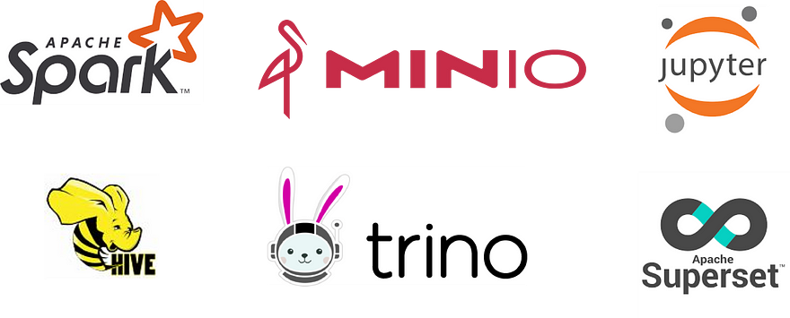

# XS Data Lake

## MinIO

**MinIO** is a high-performance object storage server that ensures scalability and data security. It's open-source and S3-compatible, making it an excellent choice for storing and managing your data with minimal setup and great compatibility with various applications, under GNU AGPL v3.

## Apache Spark

**Apache Spark** is used for distributed data processing. It's known for its speed and ease of use, enabling you to process large datasets with ease. It also offers a wide range of libraries and APIs for various data manipulation tasks, under Apache License 2.0.

## Apache Hive Metastore

**Apache Hive Metastore** is essential for managing metadata in a data warehouse. It provides a centralized repository for schema and table information, making it easier to organize and query your data in a structured and efficient manner, under Apache License 2.0

## TrinoDB

**Trino (formerly Presto)** is a powerful SQL query engine that enables seamless querying across various data sources, providing a unified interface for data analysis and exploration, under Apache License 2.0

## Jupyter Stack

**Jupyter Stack** is an interactive, web-based environment for data analysis and visualization, offering flexibility and collaboration features that are perfect for data scientists and analysts, under Modified BSD License

## Apache Superset

**Apache Superset** is a modern data exploration and visualization platform that allows you to create interactive and shareable dashboards, making it a valuable asset for data-driven decision-making.
A modern data exploration and visualization platform, under Apache License 2.0.

> As rule of tumb, always use the official images. Nowadays all stack maintain docker images.

*These tools, when used in conjunction, create a robust data ecosystem, allowing you to store, process, query, and manage your data efficiently and effectively.*
